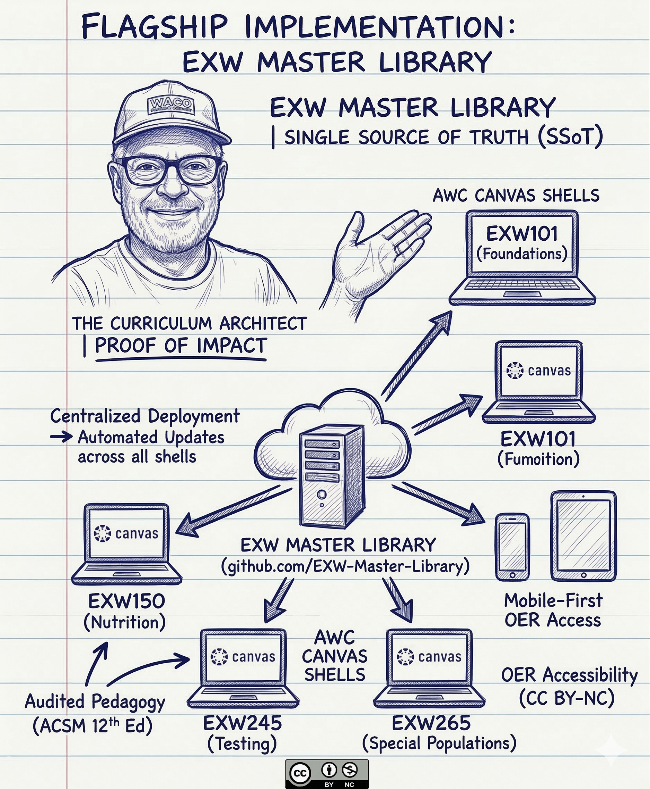

# Coach Alan Pruitt | The Curriculum Architect
## Instructional Designer • Generative AI Strategist • Adjunct Faculty
**M.S. Exercise Science & Human Performance (In Progress) | Google AI Professional Certified**

---

## 📍 Quick Navigation
[Handshake](#-google-io-2026--digital-credential) | [Mission](#-the-edtech-mission-student-centric-instructional-design) | [Tech Stack](#-technical-architecture-infrastructure-as-code) | [Spotlight](#-project-spotlight-exw-master-library) | [IP/OER](#-intellectual-property-oer-commons) | [Contact](#-connect--collaborate)

---

## 🎫 GOOGLE I/O 2026 | DIGITAL CREDENTIAL
**ID:** ALANYUMA-928
**STATUS:** GOOGLE AI PROFESSIONAL (CERTIFIED)
**ROLE:** CURRICULUM ARCHITECT / HIGHER EDUCATION

**{ VETERAN NETWORK (VETNET) MEMBER }** *Scan QR for Engineering Documentation & EXW Library*

---
[⬆️ Back to Top](#coach-alan-pruitt--the-curriculum-architect)

---

> "We frame the problem before we solve the case."

---

## 🚀 The EdTech Mission: Student-Centric Instructional Design
**AWC Mission Alignment: Scaling accessible online, hybrid, and on-campus courses.**

I use an **Antigravity IDE > GitHub > Canvas LMS** pipeline to remove barriers for community college students through OER and Google-certified AI strategies.

* **Curriculum Mapping:** Managing the EXW suite (101, 150, 245, 265) via a **Single Source of Truth (SSoT)** to ensure vertical alignment.
* **LMS Mastery:** Engineering advanced **Canvas LMS** shells with multimedia integration to enhance faculty support.
* **Universal Design:** Prioritizing **UDL** and **WCAG 2.1 AA** compliance to meet federal ADA and quality standards.

---
[⬆️ Back to Top](#coach-alan-pruitt--the-curriculum-architect)

---

## 🛠 Technical Architecture: Infrastructure-as-Code
* **Development Pipeline:** Version-controlled deployment for mobile-first responsiveness.
* **Pedagogical Framework:** **Mission Loop (Pattern / Rule / Solve)** for clinical auditing.
* **AI Integration:** Implementing agentic workflows via **Gemini 1.5 Pro** and **Nano Banana 2**.
* **Quality Assurance:** Automated **CI/CD pipeline** for real-time link validation.

**The Workflow Architecture:** `[EXW-Master-Library (SSoT)] ➔ [GitHub Pages (OER Preview)] ➔ [Canvas LMS (Production)]`

---
[⬆️ Back to Top](#coach-alan-pruitt--the-curriculum-architect)

---

## 📂 Project Spotlight: EXW Master Library
**Live Production Repository:** [alanyuma-928.github.io/EXW-Master-Library/](https://alanyuma-928.github.io/EXW-Master-Library/)

* **Centralized Deployment:** A unified library feeding standardized content to multiple Canvas shells.
* **Mobile-First OER:** Zero-barrier access to clinical guidelines (**PAGA 2018**).
* **Version Control:** All pedagogical changes tracked via Git for institutional auditing.

---
[⬆️ Back to Top](#coach-alan-pruitt--the-curriculum-architect)

---

## 📚 Intellectual Property: OER Commons
| Status      | Publication Title                    | Framework          | Link                                                    |
| :---------- | :----------------------------------- | :----------------- | :------------------------------------------------------ |
| **Active**  | **The Problem-Framer's Guide**       | "Centaur" Protocol | [View](https://oercommons.org/courseware/lesson/138815) |
| **Active**  | **AI-Enhanced Nutritional Literacy** | NUT 101 / HWE 100  | [View](https://oercommons.org/courseware/lesson/138293) |
| **Q3 2026** | *The Hyperbolic Auditor*             | EXW 245            | *In Dev*                                                |

---
[⬆️ Back to Top](#coach-alan-pruitt--the-curriculum-architect)

---

## 🎓 Course Architecture (SSoT)
**Standards:** PAGA 2018 (2nd Ed) & ACSM 12th Ed.

**Curriculum Pipeline:** `[EXW101: Pattern Recognition] ➔ [EXW150: Rule Application] ➔ [EXW245/265: Clinical Solve]`

---
[⬆️ Back to Top](#coach-alan-pruitt--the-curriculum-architect)

---

## 🏛 Webcognita LLC & Recognition
* **Legacy:** Founded in 1997; specializing in Adult Education and Public Safety training standards.
* **2025 Arizona Veteran Small Business Champion of the Year** – *U.S. SBA*
* **2023 Champion of Minority Business Development** – *U.S. Dept. of Commerce (MBDA)*

---
[⬆️ Back to Top](#coach-alan-pruitt--the-curriculum-architect)

---

## 📫 Connect & Collaborate
* **LinkedIn:** [/in/alanpruitt](https://www.linkedin.com/in/alanpruitt/)
* **Email:** [alan.pruitt@azwestern.edu](mailto:alan.pruitt@azwestern.edu)
* **Enterprises:** Webcognita LLC & Yuma Brew & View (Veteran-Owned)

---

**Licensing & IP:** This portfolio and associated templates are licensed under **CC BY-NC 4.0**.

